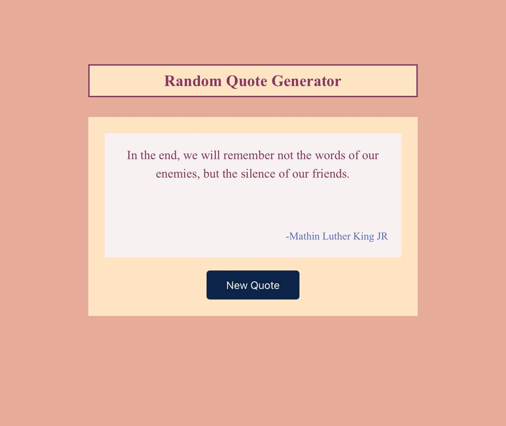

 

# Random Quote Generator

[Live](https://mike-dave.github.io/random-quote/)

## About The Project

This is a simple project on the basics of javascript and Dom manipulation

---

Users should be able to:

1. Generate new quotes
1. Get a responsive layout regardless of their screen size

---

## Built With

- HTML
- Mobile-first workflow
- CSS Flexbox
- Javascript
- Math operators (Math.random() and Math.trunc())
- DOM manipulation
